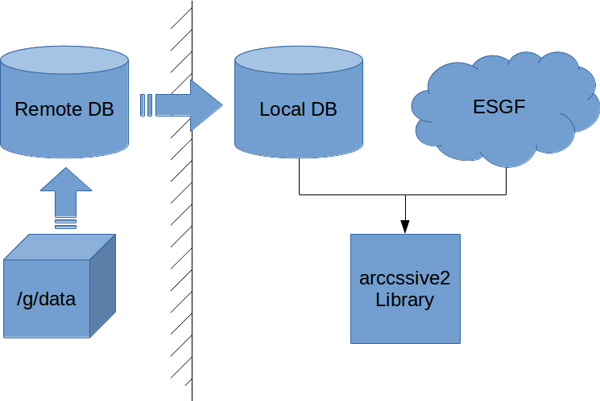

Architecture
============

clef --missing
------------

  1. Resolve any constraint wildcards by looking for matches in the local database, e.g.::

        SELECT DISTINCT model
        FROM esgf_dataset
        WHERE model ILIKE 'ACCESS%'
        ;

  2. Call `find_missing_id()` with the resolved constraints

    a. Search ESGF using the constraints, returning the checksum of each matching file

    b. Match the ESGF checksums against the local metadata database

    c. Return the ESGF id for any files whose checksums cannot be found in the local database

esgf --local
----------

  1. Query the local database for files::

        SELECT path
        FROM esgf_paths
        NATURAL JOIN esgf_metadata_dataset_link
        NATURAL JOIN esgf_dataset
        WHERE model ILIKE 'ACCESS%'
        -- ...
        ;

  2. If using the :code:`--latest` flag, query ESGF using the constraints to
       retrieve checksums, match these checksums against the local results and
       return only those found. This is the default behaviour
